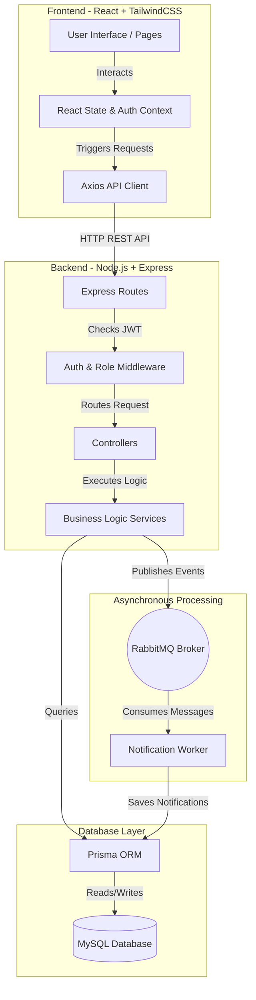

# System Architecture & Flow Diagram

The following diagram illustrates the high-level architecture and data flow of the Employee Task Management System.

### Components Description:
1. **Frontend**: The React application sends RESTful HTTP requests via Axios to the Node.js backend. State management handles JWT tokens for session persistence.
2. **Backend**: Express routes requests through authentication middleware to verify JWT tokens and roles. Controllers pass the request parameters to the Services layer.
3. **Database**: The Services layer uses Prisma ORM to execute type-safe queries on the MySQL database.
4. **Message Broker (RabbitMQ)**: When a critical event happens (like a Task being assigned), the Service layer publishes a message to RabbitMQ. A separate worker process consumes these messages in the background and saves notifications to the database, ensuring the API response isn't delayed by heavy processing.
